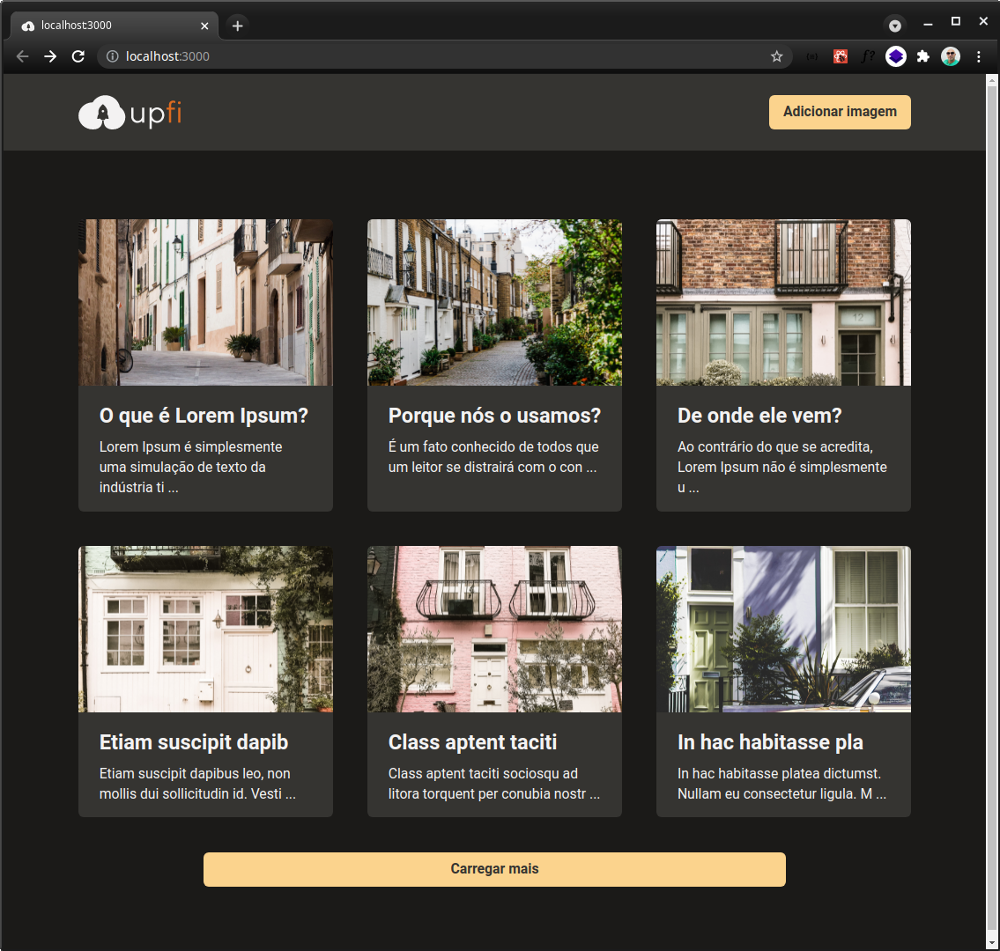
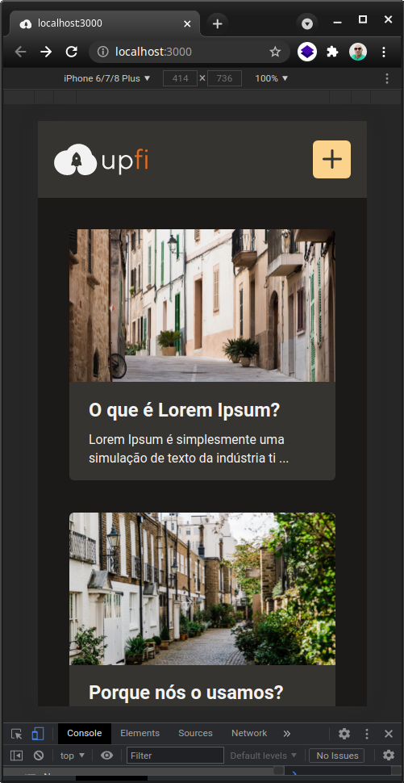
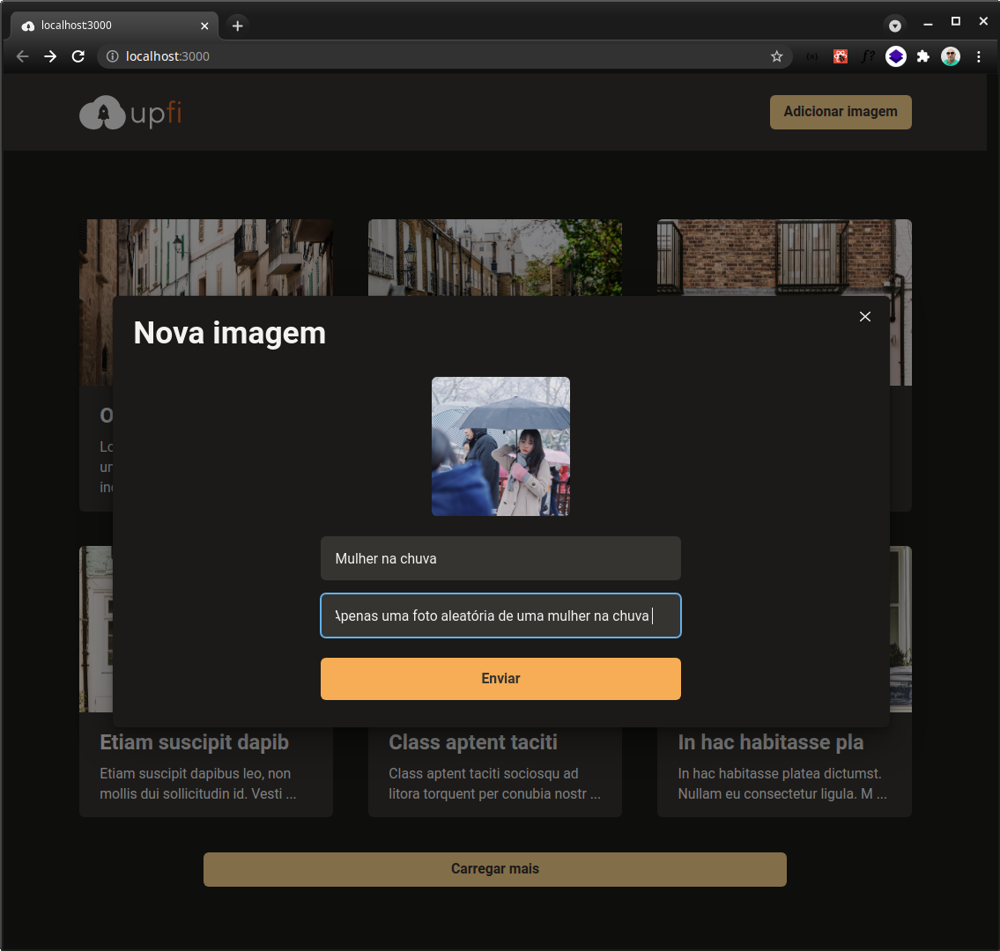
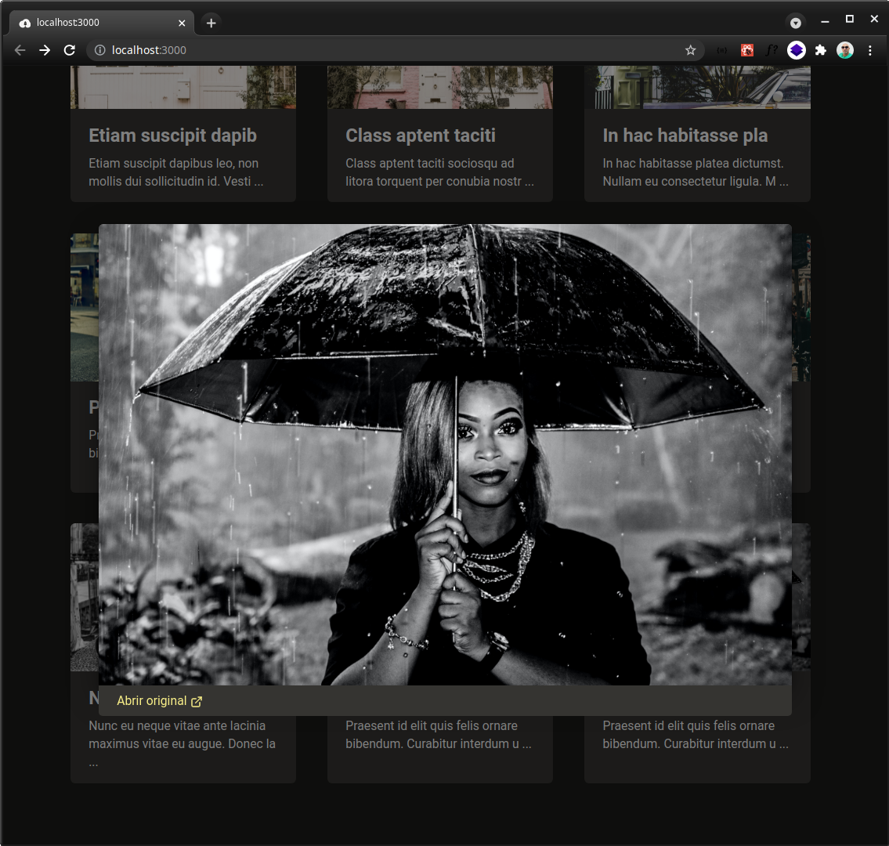

## Desafio: Upload de imagens

<div style="width: 100%; padding: 2rem; text-align:center;">

</div>

<p>
<strong>Notes:</strong> Nesse desafio, iremos realizar o upload e listagem de imagens utilizando React Query, React Hook Form e Chakra UI.
</p>
<br />

---

<br />

## Telas da aplicação
### Página inicial


<br />

---

<br />



<br />

---

<br />

## Adicionando nova imagem


<br />

---

<br />

### Visualizando uma imagem



## Tecnologias usadas

- [chakra-ui](https://chakra-ui.com)
- [reactjs](https://github.com/facebook/react)
- [typescript](https://github.com/Microsoft/TypeScript)
- [nextjs](https://github.com/vercel/next.js)
- [react-query](https://github.com/tannerlinsley/react-query)
- [fauna-db](https://fauna.com/)
- [imgbb](https://imgbb.com)

<br />

---

<br />

## Como executar baixar o projeto para sua máquina

- Copie o link (SSH)
```bash
git@github.com:andrelinos/ignite-reactjs-upload-de-imagens.git
```
### ou

- Copie o link (HTTPS)
```bash
https://github.com/andrelinos/ignite-reactjs-upload-de-imagens.git
```

## Executando o projeto
- Acesse a pasta do projeto projeto
```bash
cd ignite-reactjs-upload-de-imagens
```
- Estando dentro da pasta do projeto, execute um dos comandos abaixo para baixar as dependêncis do projeto:
```bash
yarn
```
### ou
```bash
npm
```
- Para servir o procejeto no seu localhost, execute o comando relacionado ao seu gerenciador de pacotes ``yarn`` ou ``npm``
```bash
yarn dev
```
### ou
```bash
npm dev  # ou npm run dev
```

- Feito isso, o projeto já estará disponível e basta acessar em seu navegador [http://localhost:3000](http://localhost:3000)

<br />

---

<br />

## Autor
<a href="https://app.rocketseat.com.br/me/andrelinosilva" title="Rocketseat">

<sub><br />
<b>Andrelino Silva</b></sub>  🚀</a>

<br />

---
<br />


[](https://www.linkedin.com/in/andrelinosilva/)

<br>

---
<p align="center">Made with 💜 by Andrelino Silva</p>
